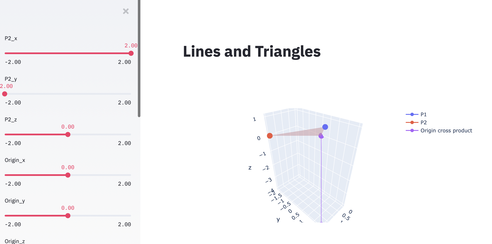

# lines_triangles_and_cross_products 

Interactively explore the relationships
between three points in a plane and the cross product.

The cross product is zero if the three points are colinear.

The cross product is maximal if one of the angles is 90 degrees.

A quaternion product though has 4 places. What does that mean?

[Use the live webapp!](https://share.streamlit.io/dougsweetser/lines_triangles_and_cross_products/webapp__lines_triangles_cross.py)

It will look like this on any device with a modern browser (PC, OSX, Linux, iOS, Android):

